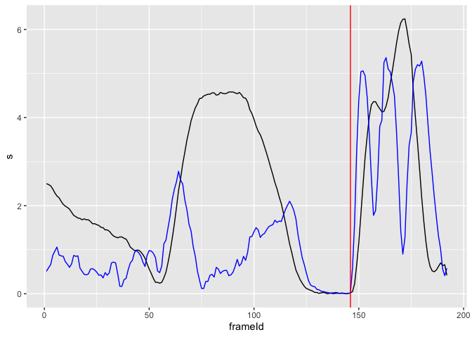
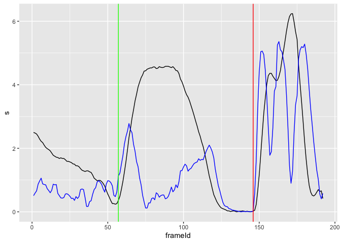
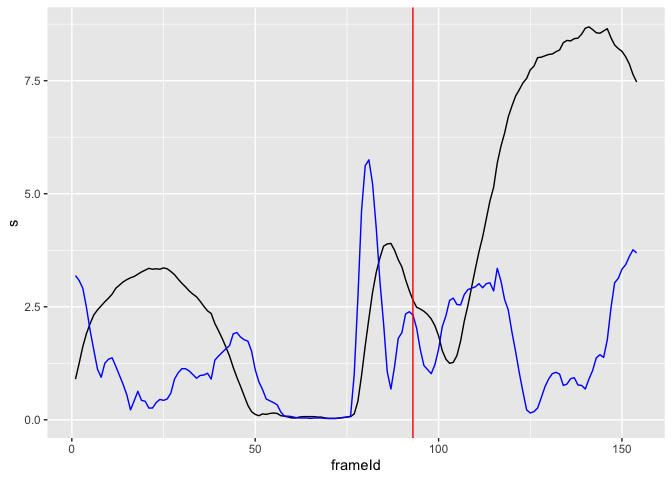
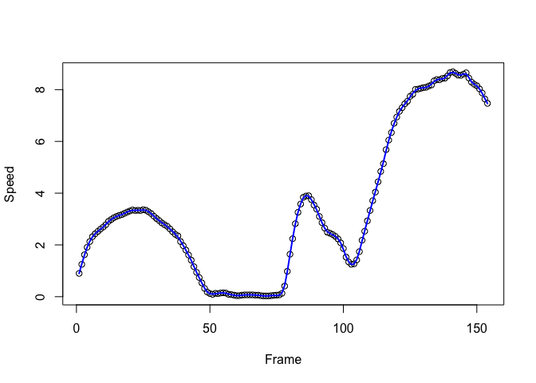
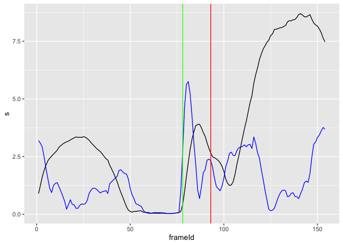

Identifying Beginning of WR Motion
================
Nolan Birkeland
2024-11-21

## Loading Packages and Data

``` r
suppressMessages(library(tidyverse))
data_dir <- "../data"

suppressMessages({
  plays <- read_csv(file.path(data_dir, "plays.csv"))
  players <- read_csv(file.path(data_dir, "players.csv"))
  player_plays <- read_csv(file.path(data_dir, "player_play.csv"))
  tracking <- read_csv(file.path(data_dir, "tracking_week_1.csv"))
})
```

    ## Warning: One or more parsing issues, call `problems()` on your data frame for details,
    ## e.g.:
    ##   dat <- vroom(...)
    ##   problems(dat)

## Cleaning

``` r
# Only tracking WRs
receivers <- players %>% filter(position == 'WR')

# Only week 1 games
gameIds <- unique(tracking$gameId)

# Only plays with WRs
motion_plays <- player_plays %>%
  filter(motionSinceLineset == TRUE & gameId %in% gameIds & nflId %in% receivers$nflId)

head(motion_plays)
```

    ## # A tibble: 6 × 50
    ##       gameId playId nflId teamAbbr hadRushAttempt rushingYards hadDropback
    ##        <dbl>  <dbl> <dbl> <chr>             <dbl>        <dbl>       <dbl>
    ## 1 2022090800     56 42489 BUF                   0            0           0
    ## 2 2022090800    236 52536 BUF                   0            0           0
    ## 3 2022090800    299 44881 LA                    0            0           0
    ## 4 2022090800    299 53678 LA                    0            0           0
    ## 5 2022090800    343 44881 LA                    0            0           0
    ## 6 2022090800    364 44881 LA                    0            0           0
    ## # ℹ 43 more variables: passingYards <dbl>, sackYardsAsOffense <dbl>,
    ## #   hadPassReception <dbl>, receivingYards <dbl>, wasTargettedReceiver <dbl>,
    ## #   yardageGainedAfterTheCatch <dbl>, fumbles <dbl>, fumbleLost <dbl>,
    ## #   fumbleOutOfBounds <dbl>, assistedTackle <dbl>, forcedFumbleAsDefense <dbl>,
    ## #   halfSackYardsAsDefense <dbl>, passDefensed <dbl>, quarterbackHit <dbl>,
    ## #   sackYardsAsDefense <dbl>, safetyAsDefense <dbl>, soloTackle <dbl>,
    ## #   tackleAssist <dbl>, tackleForALoss <dbl>, tackleForALossYardage <dbl>, …

Going forward, we will only use the first play as an example.

``` r
gid <- motion_plays$gameId[1]
pid <- motion_plays$playId[1]
receiver <- motion_plays$nflId[1]

play <- tracking %>% filter(gameId == gid & playId == pid & nflId == receiver)
```

## Basic Plotting

``` r
snap <- play %>% filter(frameType == "SNAP") %>%
  pull(frameId) %>%
  first()

play %>%
  ggplot(aes(x = frameId, y = s)) +
  geom_line() +
  geom_line(aes(x = frameId, y = a), color = "blue") + 
  geom_vline(xintercept = snap, color = "red")
```

<!-- -->

We can clearly see a large spike in both speed and acceleration (s and
a) at around frame 60. This is likely the beginning of the WR motion.
Additionally, we can see from both the speed and acceleration curve that
the WR in this example, Stefon Diggs, comes to a stop before the snap.

## Identifying Beginning of Motion

To identify the beginning of motion, we will use a spline curve to
smooth the speed curve.

``` r
library(splines)

spline_fit <- smooth.spline(play$frameId, play$s)
plot(play$frameId, play$s, xlab = "Frame", ylab = "Speed")
lines(spline_fit, col = "blue", lwd = 2)
```

<!-- -->

The curve fits the path perfectly. Now, we can take the first derivative
(acceleration), and the second (jerk).

``` r
speed <- predict(spline_fit, x = play$frameId)$y
accel <- predict(spline_fit, x = play$frameId, deriv = 1)$y
jerk <- predict(spline_fit, x = play$frameId, deriv = 2)$y
```

Using the assumption that the beginning of motion is the point where the
WR is accelerating most rapidly before the snap, we can find the frame
where jerk is maximized.

``` r
# Remove frames at/after snap
jerk <- jerk[1:snap-1]
max_jerk <- which.max(jerk)

print(max_jerk)
```

    ## [1] 57

This indicates that at frame 57, Stephon Diggs begins his motion.

``` r
play %>%
  ggplot(aes(x = frameId, y = s)) +
  geom_line() +
  geom_line(aes(x = frameId, y = a), color = "blue") + 
  geom_vline(xintercept = snap, color = "red") +
  geom_vline(xintercept = max_jerk, color = "green")
```

<!-- -->

We can see that this line just about perfectly aligns with the start of
motion.

## Another Example

We will demonstrate this approach with a play featuring motion from Gabe
Davis.

``` r
gid <- motion_plays$gameId[2]
pid <- motion_plays$playId[2]
receiver <- motion_plays$nflId[2]

play <- tracking %>% filter(gameId == gid & playId == pid & nflId == receiver)
```

### Plotting

``` r
snap <- play %>% filter(frameType == "SNAP") %>%
  pull(frameId) %>%
  first()

play %>%
  ggplot(aes(x = frameId, y = s)) +
  geom_line() +
  geom_line(aes(x = frameId, y = a), color = "blue") + 
  geom_vline(xintercept = snap, color = "red")
```

<!-- -->

### Spline Curve

``` r
spline_fit <- smooth.spline(play$frameId, play$s)
plot(play$frameId, play$s, xlab = "Frame", ylab = "Speed")
lines(spline_fit, col = "blue", lwd = 2)
```

<!-- -->

``` r
speed <- predict(spline_fit, x = play$frameId)$y
accel <- predict(spline_fit, x = play$frameId, deriv = 1)$y
jerk <- predict(spline_fit, x = play$frameId, deriv = 2)$y

# Remove frames at/after snap
jerk <- jerk[1:snap-1]
max_jerk <- which.max(jerk)

print(max_jerk)
```

    ## [1] 78

### Results

``` r
play %>%
  ggplot(aes(x = frameId, y = s)) +
  geom_line() +
  geom_line(aes(x = frameId, y = a), color = "blue") + 
  geom_vline(xintercept = snap, color = "red") +
  geom_vline(xintercept = max_jerk, color = "green")
```

<!-- -->
