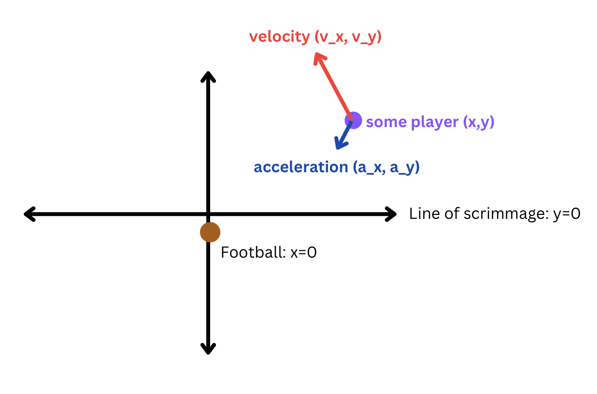

## Data Setup (`data_setup.py`)

- Run `setup()` to setup all the data files
  - Creates the `parqs` directory if it doesn't exist
  - Creates the raw tracking data
  - Creates the adjusted tracking data
  - Runs lineset and motion detection

## Data File (`data.py`)

- Ensure that the directory `data/parqs` exists.

- Use `load_tracking_raw(gid: int) -> pd.DataFrame` to load the raw tracking data by game ID. Will take about 30 seconds to run for the first time as it caches all the tracking data for all games and weeks.

- Use `load_tracking_adjusted(gid: int) -> pd.DataFrame` to load the adjusted tracking data by game ID. Will take a few minutes to run for the first time as it computes and caches all the adjusted tracking data for all games and weeks.

The adjusted tracking data does not include `s`, `a`, `o`, or `dir`, but instead includes acceleration and velocity vectors. The `x` and `y` coordinates have also been adjusted to be relative to the line of scrimmage and the football's position (`x` and `y` are also swapped so `x` has a range of `53` and `y` a range of `120`). View the graphic below for intuition on how the data has been adjusted.

## Motion Detection (`motion_detection.py`)

- Call `append_motion_event(force_calc: bool = False)` to append a column named `motion_event` to the adjusted tracking data.

- includes `"lineset"`, `"motion_start"`, `"motion_end"` - lineset is sometimes overwritten by motion start if they occur at the same frame.

- The adjusted tracking data must already exist.

### Update on Methodology

- The pre-existing lineset event was not accurate enough, so a method was added to perform lineset detection. This method simply analyzes the offenses average speed and their distance from the line of scrimmage (speed is sometimes 0 for all players during the huddle)

- The `man_in_motion` event was also not accurate for usage as a motion start indicator, so the spline method is used to calculate motion start. A slight adjustment was made to find a local jerk maxima rather than the global maximum. This is because the global jerk maximum sometimes occurs while the player is changing direction during motion.

- Motion end event is simply the first frame such that all frames after until the snap the player has 0 speed (or within some low speed threshold).

## Pre-Motion Classification (`premotion_classify.py`)

- Call `create_dataset() -> str` to create a dataset that K-means or another classification algorithm can run on
  - Return the path to dataset in parquet format (call `pd.read_parquet(path)`). The path is created from a unique timestamp in case any additional datasets are created later
